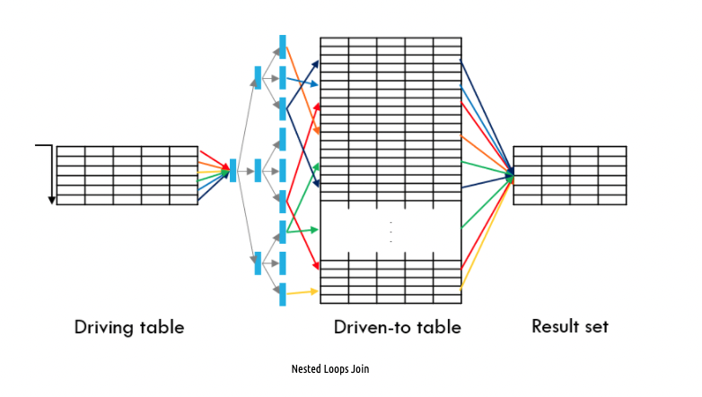
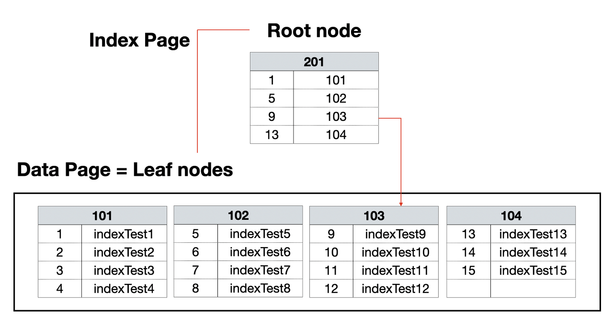
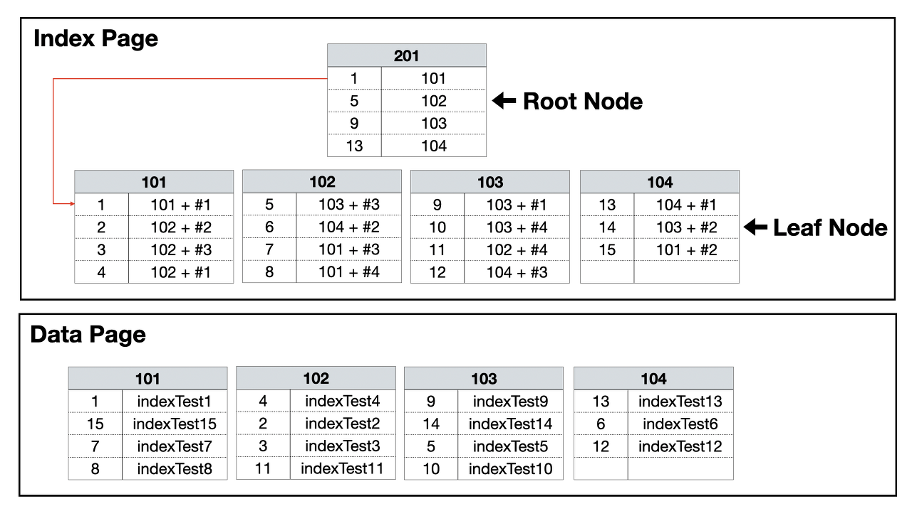

<h3> [Definition?] </h3>

- SQL 튜닝 지시자  
- Oracle Optimizer에 의존하지 않고 Custom 튜닝이 가능

<h3> [When?] </h3>

- 데이터 값을 정렬해야할 경우 효과적으로 사용 가능 
- 드라이빙 테이블을 제어하고 싶을 경우 
- 사용하고 싶은 인덱스를 바꾸고 싶을 경우 

<h3> [데이터 값을 정렬해야할 경우?]</h3>
<h4> &nbsp;order by?</h4> 

- order by는 데이터를 full scan해서 정렬하기 때문에 비효율적

<h4> &nbsp;Example</h4> 

- 가정 : IDX1(MBR_AGE), IDX2(MBR_MONEY)  

~~~sql
SELECT *
FROM MEMBER
WHERE MBR_AGE >= 30 AND MBR_MONEY >= 1000;
~~~

- ⬆️ Optimizer는 IDX1, IDX2중에 COST 계산 후 근소한 차이로 IDX1을 사용했다고 가정하면, IDX1인 MBR_AGE가 오름차순 정렬로 출력 

~~~sql
SELECT *
FROM MEMBER
WHERE MBR_AGE >= 30 AND MBR_MONEY >= 1000
ORDER BY MBR_MONEY;
~~~

- ⬆️ MBR_MONEY가 오름차순으로 출력되기 원해서 ORDER BY를 사용하면 성능 저하가 발생, IDX2의 정렬 기능을 이용하지 못한채 Full scan 정렬이 발생했기 때문

~~~sql
SELECT /*+ INDEX(MEMBER IDX2) */ *
FROM MEMBER
WHERE MBR_AGE >= 30 AND MBR_MONEY >= 1000;
~~~

- ⬆️ 인덱스 힌트를 통해서 ORDER BY 제거

<h3> [Driving Table을 제어하고 싶을 경우?]</h3>
<h4> &nbsp; Driving Table </h4>

- JOIN시에 먼저 접근되는 테이블 
- 테이블의 처리 범위를 좁혀 효율적인 JOIN이 이루어지는게 목적 
- 드라이빙 테이블은 Full scan이 발생 
- 그림 참고(출처 : https://sparkdia.tistory.com/18) 

<h4> &nbsp; Optimizer의 Driving Table 선정 기준</h4>

~~~sql
SELECT * 
FROM MEMBER, DEPT 
WHERE MEMBER.DEPT_NO = DEPT.DEPT_NO
~~~

- MEMBER, DEPT 모두 인덱스가 존재할 경우  
두 테이블 중 조회 결과가 적은 테이블을 드라이빙 테이블로 선정   
- MEMBER, DEPT 중에 한쪽만 인덱스가 없는 경우  
두 테이블 중 조회 결과가 적은 테이블을 드라이빙 테이블로 선정   
- MEMBER, DEPT 모두 인덱스가 없는 경우 
Nested Loop 조인이 이루어지지 않음   

<h4> &nbsp;Driving Table hint </h4>

- /*+LEADING */ = 테이블 접근 순서 지정 가능
- /*+ORDERED */ = From 테이블 접근 순서 유지
- 조인 방식 USE_NL, USE_HASH과 함께 사용

<h3> [사용하고 싶은 인덱스를 바꾸고 싶을 경우]</h3>

<h4> 어떤 인덱스를 힌트로 쓰는게 좋을까?</h4>
<h5> Clustered Index vs Non-clustered Index </h5>

- Clustered Index  
테이블당 1개, 
PK가 존재할 시에 자동으로 Clustered Index, 
항상 정렬 상태를 유지하므로 Insert, Delete, Update 속도가 느림, 
리프 노드가 데이터 페이지이므로, Non-clustered Index보다 빠름  

  

<h6> 출처 : https://junghn.tistory.com/ </h6>

- Non-clustered Index  
테이블당 여러개 사용 가능, 
정렬 상태를 유지하지 않으므로 Insert, Delete, Update 속도가 빠름, 
결합 인덱스로 구성이 가능하며, 컬럼 순서를 올바르게 지정해야 효율적인 탐색이 가능, 
리프 노드에서 데이터 페이지로 이동이 필요하므로, Clustered Index보다 느림  

  

<h6> 출처 : https://junghn.tistory.com/  

<h5> 결합 인덱스 vs 결합 인덱스 </h5>

- 가정 : IDX1(C1, C2, C3), IDX2(C2, C1, C3)
  
- 정렬이 중요한 경우라면,  
IDX1(C1, C2, C3) 사용 시,  
C1->C2->C3 순으로 정렬이 이루어진다.   
IDX2(C2, C1, C3) 사용 시, 
C2->C1->C3 순으로 정렬이 이루어진다.  
- 정렬이 중요하지 않고 성능이 중요한 경우라면, 
드라이빙 테이블의 범위가 작아지는 인덱스 사용 

<h3> [힌트는 항상 좋은가?] </h3>

- 옵티마이저가 더 똑똑할 수 있다... 
- 옵티마이저의 실행 계획을 정확히 이해하고, 설계한 Hint여야 한다. 
- 특정 시점에 맞춰 적용된 Hint는 데이터가 변경되면서 추후에 문제가 될 수 있다. 
- 충분한 고려없이 적용한 Hint 사용은 오히려 성능 저하로 이어진다. 

